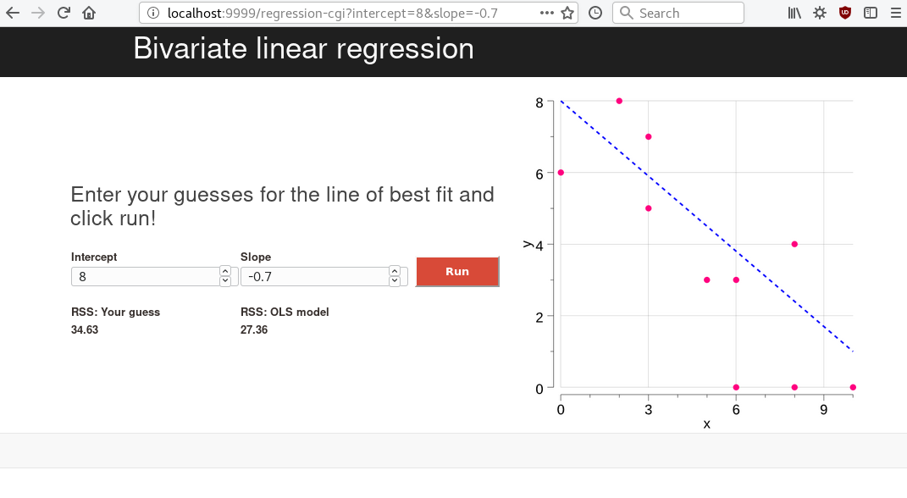

# regression-cgi
regression-cgi is a small web application to teach students how to iteratively find the line of best fit from a least squares regression. It is written in Go and uses the CGI implementation.

You can test the application after running `go build` by using the Python script (`python cgi-test.py`) and visting http://localhost:9999/regression-cgi in your browser. It should look like this:

## Requirements
* Go (1.9) 
* gonum (https://github.com/gonum/gonum)
* gonum/plot (https://github.com/gonum/plot)
